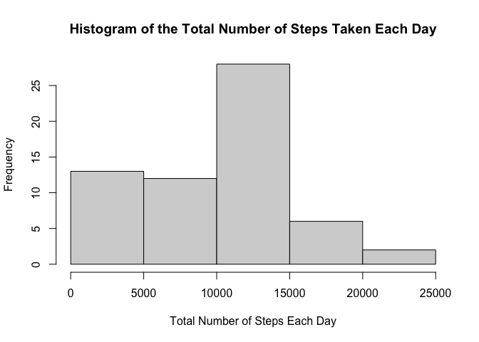
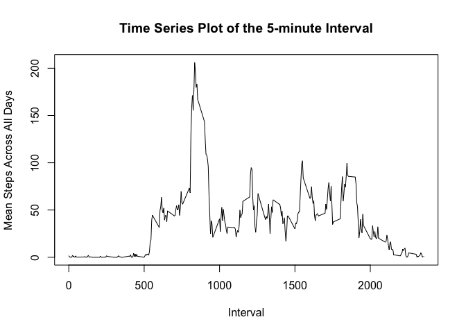
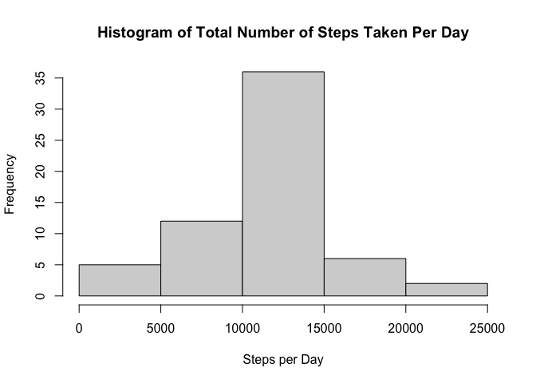
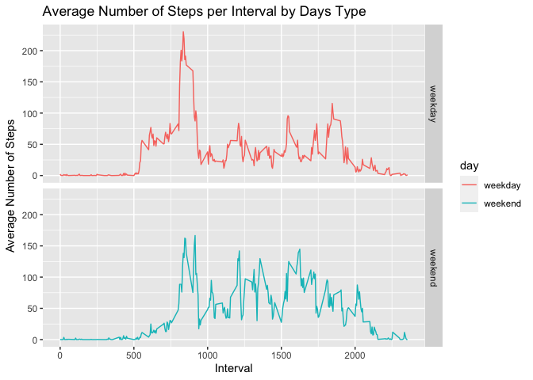

Load Packages & Set Directory:  

```r
setwd("~/Documents/Classes/Data Science JHU/Reproducible Research/RepData_PeerAssessment1")
library(dplyr)
```

```
## 
## Attaching package: 'dplyr'
```

```
## The following objects are masked from 'package:stats':
## 
##     filter, lag
```

```
## The following objects are masked from 'package:base':
## 
##     intersect, setdiff, setequal, union
```

```r
library(ggplot2)
```

## Loading and preprocessing the data

```r
data <- read.csv("activity.csv")
```

## What is mean total number of steps taken per day?

```r
## Sum steps by day
data_day_group <- group_by(data,date)
data_day_total <- summarise(data_day_group, total_steps=sum(steps, na.rm=TRUE))
```

```
## `summarise()` ungrouping output (override with `.groups` argument)
```

```r
## Histogram of the result
hist(data_day_total$total_steps, main="Histogram of the Total Number of Steps Taken Each Day", 
     xlab="Total Number of Steps Each Day")
```

<!-- -->

```r
## Summary of the data shows mean total number of steps taken per day
summary(data_day_total)
```

```
##      date            total_steps   
##  Length:61          Min.   :    0  
##  Class :character   1st Qu.: 6778  
##  Mode  :character   Median :10395  
##                     Mean   : 9354  
##                     3rd Qu.:12811  
##                     Max.   :21194
```

## What is the average daily activity pattern?

```r
## Average steps by interval, averaged across all days 
data_interval_group <- group_by(data,interval)
data_interval_average <- summarise(data_interval_group, average_steps=mean(steps, na.rm=TRUE))
```

```
## `summarise()` ungrouping output (override with `.groups` argument)
```

```r
plot(data_interval_average$interval, data_interval_average$average_steps, type = "l",
     main = "Time Series Plot of the 5-minute Interval",
     xlab = "Interval", ylab = "Mean Steps Across All Days")
```

<!-- -->

```r
## Which 5-minute interval, on average across all the days, contains the maximum number of steps?
max_index <- which.max(data_interval_average$average_steps)
## interval containing max number of steps
data_interval_average[max_index,]$interval
```

```
## [1] 835
```

```r
## max number of steps
data_interval_average[max_index,]$average_steps
```

```
## [1] 206.1698
```

## Imputing missing values

```r
## 1. total number of missing values in the dataset (i.e. the total number of rows with `NA`s)
sum(is.na(data$steps))
```

```
## [1] 2304
```

```r
## 2 Devise a strategy for filling in all of the missing values in the dataset. 
print("use the mean for the corresponding 5-minute interval")
```

```
## [1] "use the mean for the corresponding 5-minute interval"
```

```r
## 3. Create a new dataset that is equal to the original dataset but with the missing data filled in.

data_new <- data
for (i in 1:nrow(data_new)) {
        if(is.na(data_new$steps[i])) {
                data_new$steps[i] <- data_interval_average$average_steps[
                        which(data_interval_average$interval == data_new$interval[i])]
        }
}
        
## 4. Make a histogram of the total number of steps taken each day 
data_steps_sum <- aggregate(steps ~ date, data_new, sum)
hist(data_steps_sum$steps, 
     main = "Histogram of Total Number of Steps Taken Per Day", xlab = "Steps per Day")
```

<!-- -->

```r
## Calculate and report the **mean** and **median** total number of steps taken per day. 
mean(data_steps_sum$steps)
```

```
## [1] 10766.19
```

```r
median(data_steps_sum$steps)
```

```
## [1] 10766.19
```

## Are there differences in activity patterns between weekdays and weekends?

```r
## function to determine weekday or weekend
week_day_check <- function(date_x) {
        wd <- weekdays(as.Date(date_x, '%Y-%m-%d'))
        if  (wd == 'Saturday' || wd == 'Sunday') {
                day_x <- 'weekend'
        } 
        else {
                day_x <- 'weekday'
        }
        day_x
}
## add weekday or weekend to dataset
data_new$day <- as.factor(sapply(data_new$date, week_day_check))

## plot time series plot (i.e. `type = "l"`) of the 5-minute interval (x-axis) 
        ## and the average number of steps taken, averaged across all weekday days or weekend days (y-axis). 
data_average_steps <- aggregate(steps ~ interval+day, data_new, mean)
      
g <- ggplot(data_average_steps, aes(interval, steps)) +
        geom_line(stat = "identity", aes(colour = day)) +
        facet_grid(day ~ ., scales = "fixed", space = "fixed") +
        labs(x="Interval", y = expression("Average Number of Steps")) +
        ggtitle("Average Number of Steps per Interval by Days Type")
print(g)
```

<!-- -->
